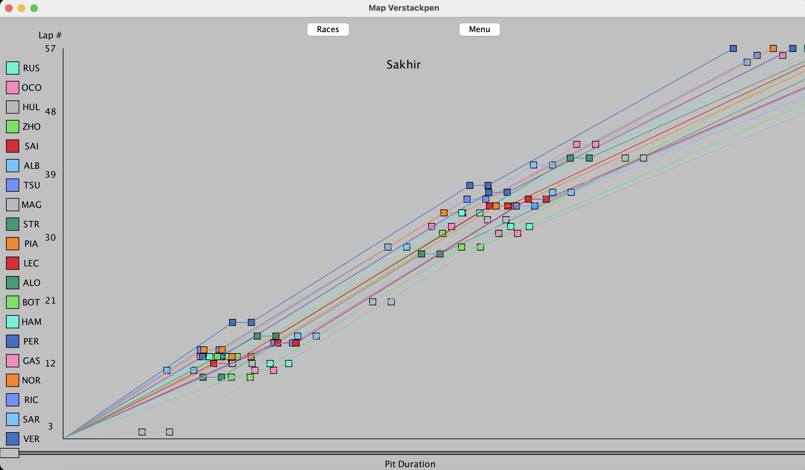

# F1 PitStop Performance

### Project Overview

Formula 1 is a high-speed motorsport where strategy is as important as speed. While the focus is often on the drivers' skill and the cars' speed, the strategy behind the scenes plays a crucial role in determining who crosses the finish line first. One of the most critical aspects of this strategy is the pit stop—a brief but key pause during the race where teams refuel, change tires, or make quick repairs. The timing and duration of a pit stop can make or break a race, affecting track position, tire performance, and, ultimately, the race's outcome. 

Through clear and interactive data visualization, PitStop Performance aims to give an inside look at the strategy that drives the thrilling world of Formula 1 racing. So take the wheel and take a drive into our project!

### Data Structures
 This project demonstrates how multiple data structures can be used to enhance backend functionality and visualization mechanics. Maps enable efficient data mapping for drivers and pit stops, Linked Lists provide dynamic storage for sequences like race events, and Arrays manage fixed collections such as lap labels. Together, these structures showcase their practical application in building efficient and interactive programs.

### How To Run Program
1. Navigate to the Main class
2. Press 'Run'
3. Select Season
4. Choose your race of choice 
5. (Wait just a few moments...) Visuals will load!

#### Disclaimer
- Select Season 2024 races for the best data visualizations.
- If there is not enough data available for a given race, once the data button is clicked, it will load "Not Enough Data Available".
- If there is not enough data for the team colours for a given race, once the data button is clicked, the graph will only show black datapoints/team colours. 
- The only race that causes crash exception is race Austin 2024 which causes the program to crash due to the API error.

##### Contributors
By Andre Mojica, Nadezhda Dominguez Salinas, and Yeshe Jangchup
